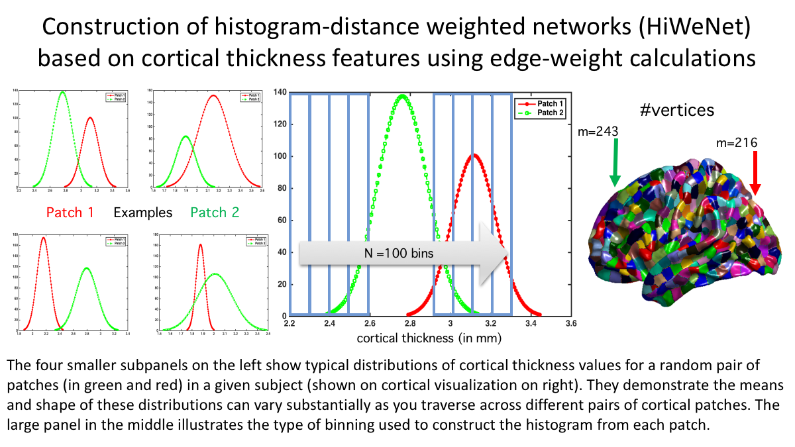

# Histogram-weighted Networks (hiwenet)

[]

Histogram-weighted Networks for Feature Extraction and Advanced Analysis in Neuroscience

Network-level analysis of various features, esp. if it can be individualized for a single-subject,
 is proving to be a valuable tool in many applications. Ability to extract the networks for a given subject individually on its own, would allow for feature extraction conducive to predictive modeling, unlike group-wise networks which can only be used for descriptive and explanatory purposes. This package extracts single-subject (individualized, or intrinsic) networks from node-wise data by computing the edge weights based on histogram distance between the distributions of values within each node. Individual nodes could be an ROI or a patch or a cube, or any other unit of relevance in your application. This is a great way to take advantage of the full distribution of values available within each node, relative to the simpler use of averages (or another summary statistic) to compare two nodes/ROIs within a given subject.

Rough scheme of computation is shown below:

## Installation

`pip install -U hiwenet`

## Documentation

|||
|--:|---|
| Docs: |  http://hiwenet.readthedocs.io |
